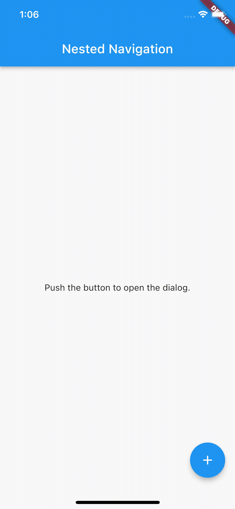

> Important: The following article is based on Flutter 2.5.0 and Get 4.3.8.

# Nested navigation with Getx

Nested navigation is a useful approach when navigation inside a screen is required or when the provided designs require specific transitions to and from the screens. This article will cover the basics for nested navigation in Flutter with the Getx framework.

***

## Table of Contents
  - [Introduction](#introduction)
  - [Navigator](#navigator)
  - [Arguments](#arguments)
  - [State management](#state-management)
  - [Bottom navigation](#bottom-navigation)

## Introduction

Have you ever had the challenge to navigate on a screen while still showing the `BottomNavigationBar` or wanted to navigate inside a dialog? Well, thats what nested navigation is for. With this approach, we can navigate independet from the root navigator of our application. First of all, we have to implement the root navigation for our app by following the Getx docs, which will result in the following `GetMaterialApp`:

```
class NestedNavigation extends StatelessWidget {
  const NestedNavigation({Key? key}) : super(key: key);

  @override
  Widget build(BuildContext context) {
    return GetMaterialApp(
      title: 'Nested Navigation',
      theme: ThemeData(primarySwatch: Colors.blue),
      getPages: <GetPage>[
        GetPage(name: '/dialog', page: () => const DialogWrapper(), fullscreenDialog: true),
        GetPage(name: '/home', page: () => const HomeScreen()),
      ],
      initialRoute: '/home',
    );
  }
}
```

Basically, this `MaterialApp` supports the naviation to our `DialogWrapper` and our `HomeScreen'.

## Navigator

Based on the very limited information from the official Getx documentation, we use the nested navigation with a widget called `Navigator` which is already provided by Flutter itself. This widget will be the root of our soon to be implemented dialog flow.

```
// the navigation inside the dialog
class DialogNavigation {
  DialogNavigation._();

  static const id = 0;

  static const dialogOne = '/dialog-one';
  static const dialogTwo = '/dialog-two';
}

// our wrapper, where our main navigation will navigate to
class DialogWrapper extends StatelessWidget {
  const DialogWrapper({Key? key}) : super(key: key);

  @override
  Widget build(BuildContext context) {
    return Navigator(
      key: Get.nestedKey(DialogNavigation.id),
      onGenerateRoute: (settings) {
        // navigate to a route by name with settings.name
        if (settings.name == DialogNavigation.dialogTwo) {
          return GetPageRoute(
            routeName: DialogNavigation.dialogTwo,
            page: () => DialogScreen(
              id: DialogNavigation.id,
              first: false,
            ),
          );
        } else {
          return GetPageRoute(
            routeName: DialogNavigation.dialogOne,
            page: () => DialogScreen(
              id: DialogNavigation.id,
              first: true,
            ),
          );
        }
      },
    );
  }
}
```

To make it a little bit easier, I created the class `DialogNavigation`, which handles all the available keys for now and also stores the id of the nested navigator. From now on, we can navigate inside the dialog, and we can also close the whole dialog without having to think about the right animation with `Get.back()`. There is also an option to provide an id inside the `Get.back()` function. As you might have already guessed: By providing the `DialogNavigation.id` to the function, we are able to navigate back inside our nested navigation.

## Arguments

Next, we might want to use Get.arguments, to move data from the current screen to the next one. Unfortunately, Get.arguments only works when using the main navigator inside your application. Here's a simple experiment to show the problems I encountered:

First, we navigate to the dialog with `Get.toNamed('/dialog', arguments: 'test')` and after that, we navigate to the next screen inside the nested naviation with `Get.toNamed(DialogNavigation.dialogTwo, id: DialogNavigation.id, arguments: 'test 2')`. In the following screen recording, you can see, that the second screen also shows 'test'.



Now it's getting a bit complicated: If Get.arguments doesn't work, how should we then pass arguments between screens? Well, as it turns out, with the RouteSettings in our onGenerateRoute inside the Navigator widget, we are able to use the arguments with settings.arguments, and we're able to pass them als normal parameters to our screens.

```
class DialogWrapper extends StatelessWidget {
  const DialogWrapper({Key? key}) : super(key: key);

  @override
  Widget build(BuildContext context) {
    return Navigator(
      key: Get.nestedKey(DialogNavigation.id),
      onGenerateRoute: (settings) {
        if (settings.name == DialogNavigation.dialogTwo) {
          // do error handling here
          print(settings.arguments is String);

          return GetPageRoute(
            routeName: DialogNavigation.dialogTwo,
            page: () => DialogScreen(
              id: DialogNavigation.id,
              first: false,
              arguments: settings.arguments,
            ),
          );
        } else {
          return GetPageRoute(
            routeName: DialogNavigation.dialogOne,
            page: () => DialogScreen(
              id: DialogNavigation.id,
              first: true,
              arguments: settings.arguments,
            ),
          );
        }
      },
    );
  }
}
```

With this, modification, we can now pass arguments to the screens inside the the nested navigation. As you can see in the code above, you could even do some simple error handling here to redirect to an error screen when the argument is not valid.

## State management

As you may know, state management with Getx is pretty simple when using bindings to push and pop routes. Controllers will then be automatically initialized and disposed when the screen is pushed and poped respecively. This apporoach can also be used with nested navigation, although I recommend using a single controller for your screens inside the nested navigator. In our current code, the GetPage provided inside our GetMaterialApp would look similar to the following code:

```
GetPage(
  name: '/dialog',
  page: () => const DialogWrapper(),
  fullscreenDialog: true,
  binding: BindingsBuilder.put(() => DialogController()),
)
```

The `DialogController` will then be available for all nested routes.

## Bottom navigation

As I've mentioned above, nested navigation is also useful when using bottom navigation. With this approach, the `BottomNavigationBar` will always be the same and this part of the screen doesn't need to be repainted. First of all, let me show you what exactly we want to accomplish:


Ok, let's take a step back again and analyze what exactly happens in the screen recording:

1. The user is able to navigate between the home and the settings screen.
2. When navigating to the detail in settings, the bottom navigation bar is still visible.
3. When tapping on the settings-item in the bottom navigation again, the the app navigates back to the previous screen inside the settings-tab.

To accomplish this, I had to make a few changes to our `GetMaterialApp`, which now initializes a controller for handling the taps in the BottomNavigationBar.

```
class NestedNavigation extends StatelessWidget {
  const NestedNavigation({Key? key}) : super(key: key);

  @override
  Widget build(BuildContext context) {
    return GetMaterialApp(
      title: 'Nested Navigation - BNB',
      theme: ThemeData(primarySwatch: Colors.blue),
      getPages: <GetPage>[
        GetPage(name: '/settings', page: () => const SettingsWrapper(), fullscreenDialog: true),
        GetPage(name: '/home', page: () => const HomeScreen()),
      ],
      initialRoute: '/home',
      initialBinding: BindingsBuilder.put(() => HomeController()),
    );
  }
}
```

Our `HomeScreen` now listens for changes to the `HomeController` and is used for changing the current screen.

```
class HomeScreen extends GetView<HomeController> {
  const HomeScreen({Key? key}) : super(key: key);

  @override
  Widget build(BuildContext context) {
    return Obx(() => Scaffold(
          bottomNavigationBar: BottomNavigationBar(
            currentIndex: controller.state.value == HomeState.home ? 0 : 1,
            onTap: (index) => index == 0 ? controller.selectHome() : controller.selectSettings(),
            items: const [
              BottomNavigationBarItem(icon: Icon(Icons.home), label: 'Home'),
              BottomNavigationBarItem(icon: Icon(Icons.settings), label: 'Settings'),
            ],
          ),
          body: Builder(
            builder: (context) {
              switch (controller.state.value) {
                case HomeState.home:
                  return Scaffold(
                    appBar: AppBar(title: const Text('BottomNavigationBar')),
                    body: const Center(child: Text('Home')),
                  );
                case HomeState.settings:
                  return const SettingsWrapper();
              }
            },
          ),
        ));
  }
}

enum HomeState { home, settings }

class HomeController extends GetxController {
  final state = HomeState.home.obs;

  void selectHome() => state.value = HomeState.home;
  Future<void> selectSettings() async {
    // check if current route is settings
    if (state.value == HomeState.settings) {
      try {
        // try to pop e.g. current route in settings is the detail
        await Get.keys[SettingsNavigation.id]!.currentState!.maybePop();
      } catch (e) {
        // error
      }
    }
    state.value = HomeState.settings;
  }
}
```

The `selectHome()` method seems pretty simple, but what happens inside the `selectSettings()` method? Well, at first the method checks if the current state is already the settings route. This could mean that the nested navigator is used and we don't really know where the user is at the moment. Then we try to pop current routes in our nested navigator by getting the current NavigatorState from Get itself. Make sure to wrap this inside a try-catch.

***

Thank you so much for reading this article to the end.